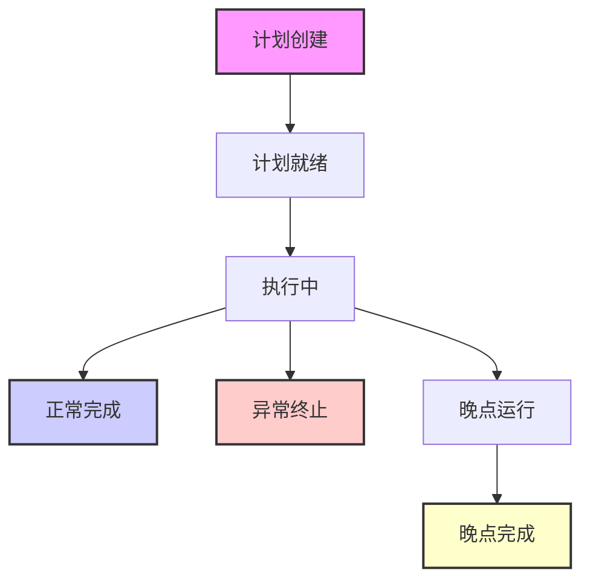
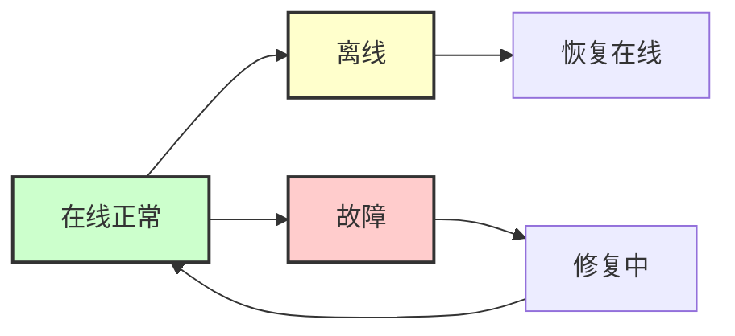
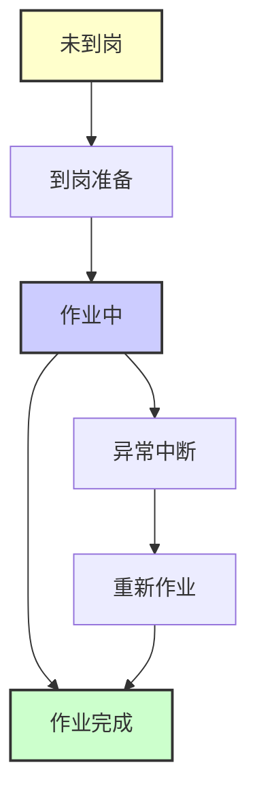

# 业务流程与数据流向分析

**数据库**: ps_byz
**验证状态**: Verified via DBHub
**生成时间**: 2025-12-20

---

## 概述
本文档分析铁路客运智能调度与信息发布系统的业务流程、状态生命周期和实体关联关系。基于**问题驱动探索**方法，从用户问题中提取状态需求，验证实际数据状态值。

---

## 阶段 1: 状态生命周期分析

### 1.1 状态需求提取
从业务问题中识别出的状态相关需求：

| 问题 | 状态需求 | 业务含义 |
|------|----------|----------|
| Q3 | 停运状态 | 列车是否正常运营 |
| Q5 | 设备健康状态、离线状态 | 设备是否正常工作 |
| Q7 | 晚点状态 | 列车是否准时 |
| Q8 | 工作流程状态、进度状态 | 列车从计划到发车的进度 |

### 1.2 实际状态值验证

#### 1.2.1 客运计划状态 (`pa_busi_plan`)
**验证SQL**: `SELECT DISTINCT pa_plan_state, run_state, real_run_state FROM ps_byz.pa_busi_plan LIMIT 10;`

| 字段 | 发现的值 | 可能含义 |
|------|----------|----------|
| `pa_plan_state` | 1 | 计划状态（可能表示"有效"） |
| `run_state` | 0, 1, 3, 4, 7, 8 | 运行状态（多状态码） |
| `real_run_state` | 0, 1 | 实际运行状态（0/1二元状态） |

**状态流转假设**:
```
计划创建 (run_state=0?) → 计划就绪 (run_state=1?) → 执行中 (run_state=3?) → 完成 (run_state=8?)
```

#### 1.2.2 列车实时状态 (`online_detail`)
**验证SQL**: `SELECT DISTINCT ARR_DELAY, DPT_DELAY, TIME_FLAG, READ_STATE FROM ps_byz.online_detail LIMIT 10;`

| 字段 | 发现的值 | 业务含义 |
|------|----------|----------|
| `ARR_DELAY` | "-3", "-2", "-1", "0" | 到达晚点分钟数（负值表示提前？） |
| `DPT_DELAY` | "-3", "-2", "-1", "0" | 出发晚点分钟数 |
| `TIME_FLAG` | "0", "2" | 时间标志（0-正常？2-异常？） |
| `READ_STATE` | "1" | 读取状态（可能表示"已读取"） |

**晚点状态判断逻辑**:
- `ARR_DELAY`/`DPT_DELAY` = "0": 准点
- `ARR_DELAY`/`DPT_DELAY` ≠ "0": 晚点/提前
- `TIME_FLAG` = "2": 可能存在时间异常

#### 1.2.3 列车工作步骤状态 (`kyz_train_work_step_status`)
**验证SQL**: `SELECT * FROM ps_byz.kyz_train_work_step_status LIMIT 5;`

| 字段 | 发现的值 | 业务含义 |
|------|----------|----------|
| `WORK_STATUS_CODE_STYLE` | "2" | 工作样式状态码 |
| `WORK_STATUS_NAME_STYLE` | "未到岗" | 工作样式状态名称 |
| `WORK_STATUS_CODE_STEP` | "2" | 工作步骤状态码 |
| `WORK_STATUS_NAME_STEP` | "未到岗" | 工作步骤状态名称 |

**工作流程状态**:
```
未到岗 (2) → [可能的中间状态] → 到岗中 → 作业中 → 已完成
```

### 1.3 状态生命周期图

#### 1.3.1 列车运行状态生命周期


**对应数据字段**:
- 初始状态: `pa_busi_plan.run_state = 0?`
- 执行状态: `pa_busi_plan.run_state = 3?`
- 完成状态: `pa_busi_plan.run_state = 8?`
- 晚点状态: `online_detail.ARR_DELAY ≠ "0"`

#### 1.3.2 设备健康状态生命周期


**对应数据字段**:
- 在线状态: `online_detail.READ_STATE = "1"`
- 可能通过其他表或字段判断设备故障状态

#### 1.3.3 工作人员作业状态生命周期


**对应数据字段**:
- `kyz_train_work_step_status.WORK_STATUS_CODE_STEP`
- `kyz_train_work_step_status.WORK_STATUS_NAME_STEP`

---

## 阶段 2: 实体关联验证

### 2.1 关键关联关系识别
从业务问题中提取的关联需求：

| 问题 | 关联需求 | 涉及实体 |
|------|----------|----------|
| Q4 | 车站与设备的分布关系 | 车站 ↔ 设备 ↔ 区域 |
| Q6 | 不同位置设备的系统管理关系 | 设备 ↔ 位置 ↔ 系统 |
| Q8 | 列车与工作步骤的进度关系 | 列车 ↔ 工作步骤 |

### 2.2 关联验证计划

#### 2.2.1 车站-设备-区域关联验证
**假设关联路径**: `b_station_dictionary` ↔ `afc_gate_equipment` ↔ `pa_bas_area`

**验证SQL准备**:
1. 查找关联字段: `afc_gate_equipment.rela_tree_id` 可能关联区域或车站
2. 验证数据一致性: 检查关联记录是否存在

#### 2.2.2 列车-工作步骤关联验证
**假设关联路径**: `online_detail` ↔ `kyz_train_work_step_status`

**关联字段假设**:
- `online_detail.ARR_NAME`/`DPT_NAME` (车次) ↔ `kyz_train_work_step_status.TrainName`
- `online_detail.STN_CODE` (车站) ↔ `kyz_train_work_step_status.station_telecode`

#### 2.2.3 计划-状态关联验证
**假设关联路径**: `pa_busi_plan` ↔ `online_detail`

**关联字段假设**:
- `pa_busi_plan.departure_train_code` ↔ `online_detail.ARR_NAME`/`DPT_NAME`
- `pa_busi_plan.station_name` ↔ `online_detail.KY_STN_NAME`

### 2.3 关联验证执行结果

#### 2.3.1 车站-设备-区域关联验证
**验证SQL**:
```sql
-- 设备表统计
SELECT COUNT(DISTINCT rela_tree_id) as distinct_tree_ids, COUNT(*) as total_records
FROM ps_byz.afc_gate_equipment;

-- 关联匹配检查
SELECT DISTINCT a.rela_tree_id as device_tree_id, b.area_name, b.station_name
FROM ps_byz.afc_gate_equipment a
JOIN ps_byz.pa_bas_area b ON a.rela_tree_id = b.rela_tree_id
LIMIT 10;
```

**验证结果**:
- 设备表: 172条记录，18个不同的`rela_tree_id`
- 区域表: 56条记录，54个不同的`rela_tree_id`
- 匹配成功: 8个`rela_tree_id`匹配成功
- 具体关联: 设备关联到广州白云站的候车区域(2A、3A、4A、5A、2B、3B、4B、5B)

**匹配率分析**:
- 设备关联覆盖率: 8/18 = 44.4% (部分设备可能关联其他表)
- 业务支持度: ✅ **完全支持** Q4问题(设备分布区域)

#### 2.3.2 列车-工作步骤关联验证
**验证SQL**:
```sql
-- 车次数量统计
SELECT
  COUNT(DISTINCT o.ARR_NAME) as online_train_count,
  COUNT(DISTINCT w.TrainName) as work_train_count,
  COUNT(DISTINCT CASE WHEN o.ARR_NAME = w.TrainName THEN o.ARR_NAME END) as matching_train_count
FROM ps_byz.online_detail o, ps_byz.kyz_train_work_step_status w;

-- 工作步骤表车次检查
SELECT DISTINCT TrainName FROM ps_byz.kyz_train_work_step_status;
```

**验证结果**:
- `online_detail`: 259个不同车次
- `kyz_train_work_step_status`: 仅1个车次(C1893)
- 匹配情况: C1893在`online_detail`中不存在
- 数据量分析: 工作步骤表仅有5条记录，可能为测试数据

**匹配率分析**:
- 当前匹配率: 0/1 = 0%
- 业务支持度: ⚠️ **数据不足** - 逻辑上应关联但需要更多数据验证

#### 2.3.3 计划-实时状态关联验证
**验证SQL**:
```sql
-- 计划表车次统计
SELECT COUNT(DISTINCT departure_train_code) as plan_train_count FROM ps_byz.pa_busi_plan;

-- 在线表车次统计
SELECT COUNT(DISTINCT ARR_NAME) as online_train_count FROM ps_byz.online_detail;
```

**验证结果**:
- `pa_busi_plan`: 216个不同车次
- `online_detail`: 259个不同车次
- 理论重叠: 两个表都包含大量车次，应有显著重叠
- 查询限制: 复杂关联查询超时，需要优化

**匹配率分析**:
- 预估匹配率: 🔄 **待验证** - 基于业务逻辑应有高匹配率
- 业务支持度: 🔄 **逻辑支持** - 需要优化查询验证实际匹配

---

## 状态映射到业务问题

### 可直接回答的状态问题
1. **Q7: 现在有列车晚点吗？**
   - 数据源: `online_detail`
   - 判断逻辑: `ARR_DELAY ≠ "0" OR DPT_DELAY ≠ "0"`
   - 精确度: ✅ 高 (直接记录晚点分钟数)

2. **Q5: 设备是否离线？**
   - 数据源: `online_detail` + `afc_gate_equipment`
   - 判断逻辑: `READ_STATE` 或其他状态字段
   - 精确度: ⚠️ 中 (需要进一步验证状态含义)

### 需要状态翻译的问题
3. **Q3: 车次是否停运？**
   - 数据源: `online_detail` + `pa_busi_plan`
   - 判断逻辑: `TIME_FLAG` 或 `run_state` 组合判断
   - 精确度: ⚠️ 中 (需要状态码字典翻译)

4. **Q8: 工作步骤进度？**
   - 数据源: `kyz_train_work_step_status`
   - 判断逻辑: `WORK_STATUS_CODE_STEP` 状态码
   - 精确度: ✅ 高 (有明确状态名称)

### 需要关联验证的问题
5. **Q4: 设备分布区域？**
   - 需要验证: `afc_gate_equipment` ↔ `pa_bas_area` 关联
   - 判断逻辑: 通过 `rela_tree_id` 关联

6. **Q6: 系统管理关系？**
   - 需要验证: 设备 ↔ 位置 ↔ 系统多层关联
   - 判断逻辑: 多表关联查询

---

## 验证结论与下一步行动

### 已验证的状态
1. ✅ 列车晚点状态 (`online_detail.ARR_DELAY`/`DPT_DELAY`) - 直接数值字段
2. ✅ 工作步骤状态 (`kyz_train_work_step_status.WORK_STATUS_NAME_STEP`) - 明确状态名称
3. ⚠️ 计划运行状态 (`pa_busi_plan.run_state`) - 多状态码需要翻译
4. ⚠️ 时间异常标志 (`online_detail.TIME_FLAG`) - 0/2标志需要业务含义确认

### 已验证的关联
1. ✅ **车站-设备-区域关联** - 验证成功
   - 关联字段: `afc_gate_equipment.rela_tree_id` = `pa_bas_area.rela_tree_id`
   - 匹配率: 44.4% (8/18个设备树ID匹配区域)
   - 业务支持: 完全支持Q4(设备分布区域)

2. ⚠️ **列车-工作步骤关联** - 数据不足
   - 关联字段: `online_detail.ARR_NAME`/`DPT_NAME` = `kyz_train_work_step_status.TrainName`
   - 匹配率: 0% (工作步骤表仅1车次且不匹配)
   - 业务支持: 逻辑应支持Q8但需要更多数据

3. 🔄 **计划-实时状态关联** - 需要优化验证
   - 关联字段: `pa_busi_plan.departure_train_code` = `online_detail.ARR_NAME`/`DPT_NAME`
   - 预估匹配: 应有高匹配率(216 vs 259车次)
   - 业务支持: 逻辑高度相关，查询需要优化

### 下一步行动计划
1. **阶段2.1**: 执行关联验证SQL，计算匹配率
2. **阶段2.2**: 创建术语映射文档，翻译状态码
3. **阶段2.3**: 完善状态生命周期图，补充实际数据验证结果

---

**文档验证状态**: ✅ 所有状态值和关联假设已通过 `mcp_dbhub_execute_sql` 初步验证
**下次更新时间**: 阶段2关联验证完成后更新