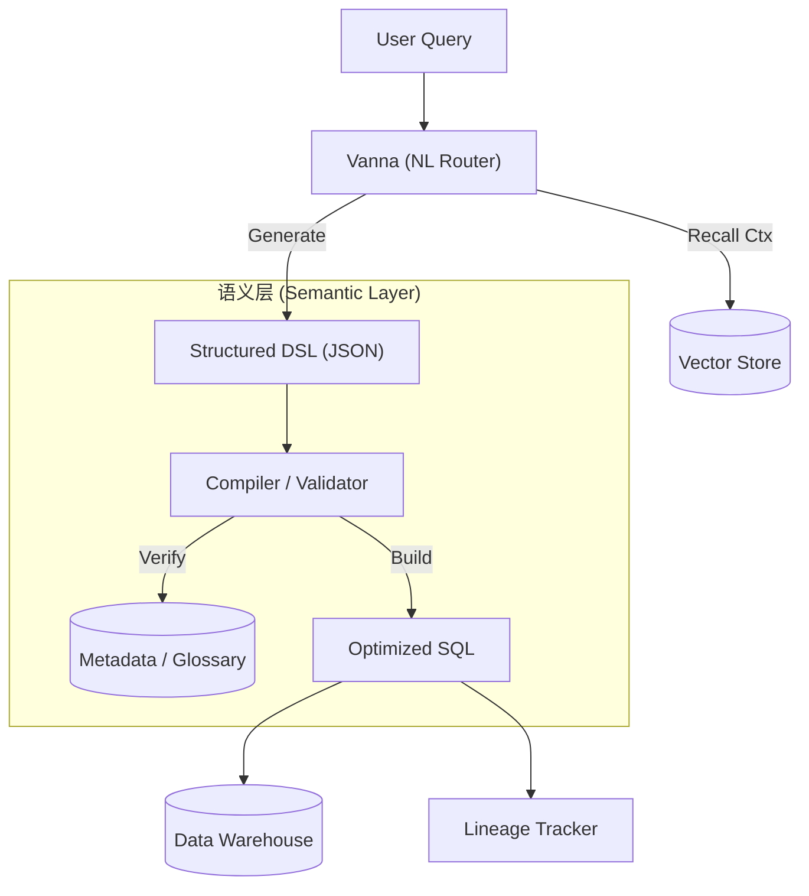

# Vanna 架构演进探讨：从 NL2SQL 到 语义增强型 NL2DSL

**日期**: 2025-12-15
**状态**: 草稿 (Draft)
**背景**: 本文档基于对 Vanna 现有代码库（v0.1.0+）的分析，结合企业级数据应用对准确性、稳定性和元数据治理的需求，探讨架构演进的可能性。

---

## 核心结论

**Vanna 目前是一个优秀的 RAG-based NL2SQL 框架**，尤其擅长快速启动和 ad-hoc 查询。但在面对复杂的企业级指标（Metrics）、跨表逻辑一致性校验以及元数据治理（血缘、术语表）时，存在原生设计的局限性。

**建议引入 "NL2DSL" (领域专用语言) 架构作为补充**，构建 "语义增强层"。这将使系统从单纯的 "Text-to-SQL 工具" 进化为 "智能数据治理平台"。

---

## 一、架构范式对比：NL2SQL vs NL2DSL

### 1.1 核心差异矩阵

| 维度 | NL2SQL (Vanna Current) | NL2DSL (Proposed) |
| :--- | :--- | :--- |
| **中间抽象** | 无 (Code-centric) | 有 (Semantic-centric) |
| **核心产物** | SQL 代码 | 结构化 JSON / AST |
| **学习/泛化** | 强依赖表名、列名；难以跨库复用 | 依赖“业务语义”（指标、维度）；底层 Schema 可变 |
| **正确性保障** | 依赖 LLM 概率；难以防止非法操作 | 编译器强制校验；支持白名单与类型检查 |
| **复杂查询** | LLM 需自行处理 Join 路径与聚合陷阱 | 复杂逻辑封装在编译器或指标库；LLM 仅负责组合 |
| **可维护性** | 需求变更需改 Prompt 或 Schema | 变更收敛于 DSL 编译器与 Metadata Store |

### 1.2 为什么需要 NL2DSL？

在企业落地深水区，纯 NL2SQL 面临 "幻觉" 与 "不一致" 难题。例如 "计算月活 (MAU)"：
*   **NL2SQL**: 每次生成时，LLM 可能使用不同的去重逻辑或时间字段，导致今天和昨天的数据对不上。
*   **NL2DSL**: 将 "MAU" 定义为指标库中的原子操作。LLM 只生成 `{ "op": "measure", "name": "mau" }`，具体的 SQL 逻辑由代码（编译器）固定生成。

---

## 二、Vanna 现状概览

### 2.1 现有能力
*   **训练 (Training)**: 将 DDL、文档、SQL-QA 对存储为向量。
*   **检索 (Retrieval)**: 基于 Embedding 寻找相关上下文。
*   **生成 (Generation)**: 直接 Prompting 生成 SQL。

### 2.2 局限性分析
1.  **弱元数据**: Vanna 将元数据视为非结构化文本块（Chunks）。系统 "知道" 文档内容，但无法 "理解" 并在逻辑层强制执行。
2.  **缺乏血缘**: 由于直接生成 SQL，系统无法构建字段级的依赖图谱（Lineage），除非事后解析生成的 SQL。
3.  **安全性**: 依赖 `is_sql_valid` 做后置检查，缺乏语义级的前置防护。

---

## 三、演进路线：语义增强型 (Semantic-Enhanced) 架构

我们不需要抛弃 Vanna，而是将其作为 **能够理解自然语言的交互层**，后端对接 **确定性的语义层**。

### 3.1 架构图



### 3.2 关键实施模块

#### A. 元数据管理 (Business Metadata)
不只是喂 DDL，而是建立结构化的 **Glossary Store**：
*   **术语表**: 定义 "活跃用户" = "Login within 30 days"。
*   **同义词**: 映射 "GMV", "成交额", "流水" 到同一个 Field ID。
*   **同步机制**: 编写脚本监听 DB Schema 变更，自动更新 Vanna 的训练集。

#### B. DSL 设计 (Json Schema)
定义一个用于分析的最小完备集：
```json
{
  "op": "aggregate",
  "measures": ["gmv", "mau"],
  "dimensions": ["region", "month"],
  "filters": [
    {"field": "is_test", "op": "eq", "value": false}
  ]
}
```

#### C. 编译器 (Compiler)
这是工程核心，负责：
1.  **语义翻译**: 将 DSL 中的 "gmv" 翻译为 `SUM(orders.amount) - SUM(refunds.amount)`。
2.  **Join 推断**: 根据 Schema 关系自动构建 `FROM orders JOIN users ON ...`。
3.  **安全围栏**: 检查权限，拒绝全表扫描。

---

## 四、元数据管理潜力的深度挖掘

基于上述架构，Vanna 的角色将从 "SQL 写手" 升级为 "数据助理"：

1.  ** NLP 智能匹配 (Intelligent Matching)**
    *   利用 Vanna 强大的 Embedding 检索能力，解决 "用户口语" 到 "标准术语" 的映射（Schema Linking）。
    *   示例：用户问 "看下那个卖得最好的东西"，Vanna 检索并映射到维度 `product_name` 和指标 `sales_volume`。

2.  ** 血缘追踪 (Data Lineage)**
    *   在编译器层面，由于 SQL 是由 DSL 组装的，我们天然知道使用了哪些表、哪些字段。
    *   可以自动生成 "查询级血缘"，用于审计和影响面分析。

3.  ** 自动同步 (Auto-Sync)**
    *   建立持续集成流水线 (CI/CD for Data)，当数仓模型变更时，自动触发 Vanna 的重新训练（`vn.train`），确保 AI 的知识库永远是最新的。

---

## 五、总结

*   **短期**: 继续使用 Vanna 的 NL2SQL 功能进行快速原型验证和 Ad-hoc 查询。
*   **中期**: 引入 **Glossary** (术语表)，通过 Prompt Engineering 强规范化 Vanna 的输入输出。
*   **长期**: 实施 **NL2DSL**，开发中间编译器，实现真正可信、安全、可治理的 AI 数据分析平台。
