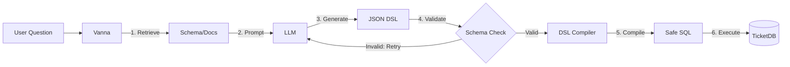

# NL2DSL MVP Integration Strategy

**Date**: 2025-12-15
**Context**: Defines how the new Semantic Layer (NL2DSL) integrates with the existing Vanna framework.

## 1. Code Architecture

The NL2DSL MVP is implemented as a standalone sub-package to maintain loose coupling with the core RAG/VectorDB logic.

*   **`src/vanna/dsl/` (New Subsystem)**
    *   **Role**: Pure Semantic Layer. Independence from Vanna Core.
    *   **Components**:
        *   `schema.py`: Pydantic models defining the JSON DSL.
        *   `compiler.py`: Logic to translate JSON DSL -> SQLAlchemy AST -> SQL.
        *   `errors.py`: Domain-specific exceptions (e.g., `DSLCompileError`).

*   **`src/vanna/core/nl2dsl.py` (Integration Layer)**
    *   **Role**: Orchestrator connecting LLM to DSL.
    *   **Responsibilities**:
        *   Constructing Few-Shot Prompts (Golden Q&A).
        *   Calling `generate_dsl()` (LLM Interaction).
        *   Calling `compile_dsl()` (Compilation).
        *   Handling Retry Logic for validation errors.

## 2. Data Flow

The `run_nl2dsl` execution flow introduces a structured intermediate step compared to the traditional `ask` method.



## 3. User API

Users access the semantic layer via new methods on the standard `VannaDefault` (or custom) object.

```python
# 1. Initialization (Unchanged)
vn = VannaDefault(model='...', api_key='...')
vn.connect_to_sqlite('ticket.db')

# 2. Semantic Analysis (New)
# usages the DSL pipeline for guaranteed structure and safety
df = vn.run_nl2dsl("Show me total sales by region")

# 3. Inspection (Debugging)
dsl = vn.generate_dsl("Show me total sales by region")
sql = vn.compile_dsl(dsl)
```

## 4. Key Benefits

1.  **Safety**: Invalid column references are caught *before* SQL generation.
2.  **Determinism**: The Compiler ensures the SQL syntax is always valid if the DSL is valid.
3.  **Security**: SQL injection is impossible via the DSL path due to parameter binding in SQLAlchemy.
