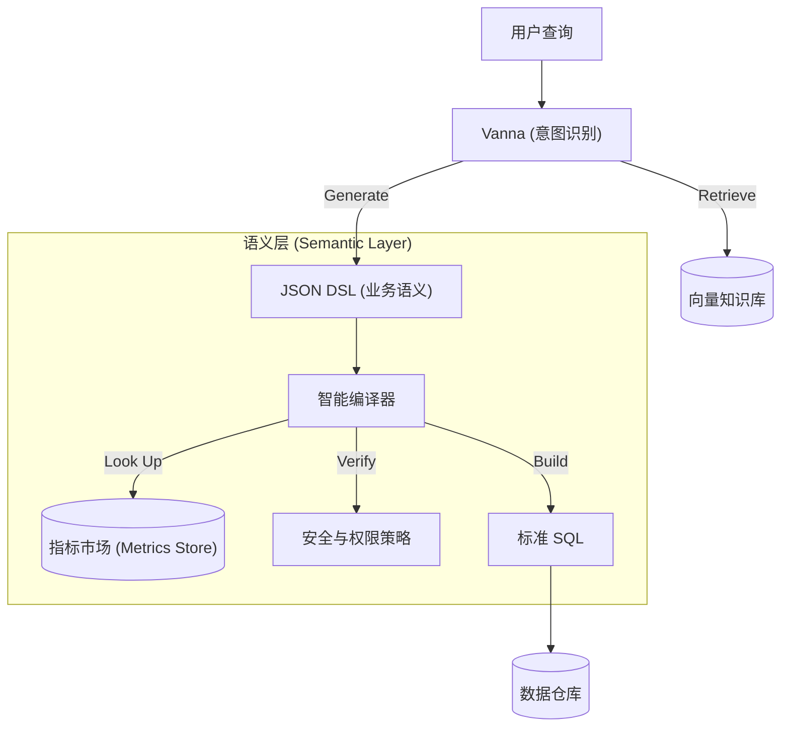

# 项目建议书：基于 Semantic Layer 的 Vanna 智能化增强工程

**项目名称**: 语义增强型 Vanna 架构演进 (Semantic-Enhanced Vanna Project)
**申请部门**: 数据智能研发组
**日期**: 2025-12-15
**版本**: v1.0

---

## 1. 执行摘要 (Executive Summary)

本项目旨在通过引入 **"NL2DSL + 语义层 (Semantic Layer)"** 架构，对现有开源 NL2SQL 框架 Vanna 进行深度改造。项目致力于解决当前生成式 AI 在企业数据分析中普遍面临的**"逻辑幻觉"**、**"口径不一致"**和**"安全不可控"**三大核心痛点。

通过构建中间态的领域专用语言 (DSL) 和确定性的编译器，我们计划将 Vanna 从一个单纯的 "Text-to-SQL 工具" 升级为 **"可信、安全、可治理的企业级 AI 数据分析平台"**。预期在实施后，复杂查询的准确率提升至 85% 以上，指标口径的一致性达到 100%。

---

## 2. 项目背景与现状 (Background)

### 2.1 现有系统介绍：Vanna
Vanna 是目前业界领先的 RAG-based (检索增强生成) NL2SQL 开源框架。其核心工作流如下：
1.  **训练**: 对数据库 DDL、文档和 SQL 问答对进行向量化存储。
2.  **生成**: 用户提问 -> 检索相关上下文 -> LLM 生成 SQL -> 直接在数据库执行。

### 2.2 现有问题与挑战
尽管 Vanna 在快速原型验证和简单查询场景表现优异，但在深入企业级复杂应用时暴露了结构性缺陷：
*   **不稳定性 (Illusion)**: 面对 "计算月活 (MAU)" 等复杂逻辑，LLM 每次生成的 SQL 可能逻辑不一（如去重方式不同），导致数据不可信。
*   **弱元数据治理**: 缺乏对业务术语（Business Glossary）和指标（Metrics）的结构化管理，LLM 只能依靠非结构化文档进行"猜测"。
*   **安全隐患**: 依赖生成的 SQL 进行后置校验，难以从语义层面防止全表扫描或敏感字段越权。

---

## 3. 项目初衷与建设目标 (Objectives)

### 3.1 建设初衷
本项目的初衷并非推翻 Vanna，而是**"取其精华，补其短板"**。我们要保留 Vanna 强大的自然语言理解与检索能力（作为 Router），但在其后端增加一道**"防波堤"**——即确定性的语义层。我们的意图是让 AI 负责"理解意图"，让代码负责"执行逻辑"，实现人机分工的最优化。

### 3.2 建设目标
1.  **准确性 (Accuracy)**: 消除因 SQL 语法或方言差异导致的错误，确保业务指标计算逻辑 100% 遵循预定义公式。
2.  **一致性 (Consistency)**: 建立统一的 Metrics Store，确保无论用户如何提问，"GMV" 的计算口径永远唯一。
3.  **可治理 (Governance)**: 实现字段级的血缘追踪 (Lineage) 和细粒度的权限控制 (Row/Col Security)。

---

## 4. 技术方案 (Technical Solution)

### 4.1 核心架构：NL2DSL 范式
我们将采用 **NL2DSL (Natural Language to Domain Specific Language)** 架构替代纯 NL2SQL：
*   **Input**: 用户自然语言查询。
*   **Intermediate**: LLM 生成结构化 **JSON DSL** (去除 SQL 细节，保留业务语义)。
*   **Output**: 编译器 (Compiler) 将 DSL 编译为优化后的 SQL。

### 4.2 架构图谱

### 4.3 关键模块设计
1.  **DSL Schema**: 定义一套原子化的 JSON 协议，包含 `Source`, `Filter`, `Aggregation`, `TimeGrain` 等算子。
2.  **指标库 (Metrics Store)**: 使用 YAML 定义业务指标（如 `gmv = sum(amount)`），编译器自动解析，杜绝 LLM 瞎编公式。
3.  **智能编译器**: Python 实现的转译引擎，负责 Join 路径推断、方言适配和 SQL 生成。

---

## 5. 实施计划 (Implementation Roadmap)

本项目预计周期为 12 周，分为四个阶段：

| 阶段 | 周期 | 核心任务 | 交付物 |
| :--- | :--- | :--- | :--- |
| **P1: 核心MVP** | Week 1-4 | 定义 DSL Schema；开发基础编译器；跑通单表闭环 | MVP 原型；DSL 规范文档 |
| **P2: 语义层构建** | Week 5-8 | 引入 Metrics Store；实现指标自动展开；支持自动 Join | 语义层中间件；指标管理规范 |
| **P3: 治理与安全** | Week 9-10 | 注入行/列级权限；实现基于 DSL 的血缘解析 | 安全增强版编译器；血缘报告 |
| **P4: 优化与验收** | Week 11-12 | 性能优化（缓存）；端到端测试；业务验收 | 生产就绪版本；验收报告 |

---

## 6. 可行性与风险分析 (Feasibility & Risk)

### 6.1 技术可行性
*   **成熟度高**: JSON Schema + Pydantic + SQLAlchemy 是成熟的 Python 技术栈。
*   **低侵入性**: Vanna 作为前端 Router 只需修改 Prompt，无需重构核心逻辑。

### 6.2 关键风险与应对
1.  **风险**: DSL 表达力不足，无法覆盖复杂窗口函数或 CTE。
    *   **应对**: 前期进行 Top 100 历史 SQL 覆盖率测试；保留 Raw SQL 逃生通道。
2.  **风险**: 指标定义与数仓实际 Schema 脱节。
    *   **应对**: 建立 CI/CD 流水线，监听 DB Schema 变更并自动报警。

---

## 7. 资源需求 (Resources)

1.  **人力投入**:
    *   后端工程师 (Python/SQL) x 2：负责编译器与语义层开发。
    *   数据工程师 x 1：负责指标梳理与 Metrics Store 构建。
2.  **计算资源**:
    *   维持现有 Vanna 部署资源即可，Compiler 带来的计算开销极低。

---

## 8. 结论 (Conclusion)

本项目提出的 "语义增强型" 架构是 AI 数据分析从 "Toy Demo" 走向 "Production Ready" 的必经之路。通过引入确定性的 DSL 中间层，我们不仅能解决幻觉问题，更能以此为契机，建立起企业级的数据治理规范。建议批准立项并尽快启动 MVP 验证。
