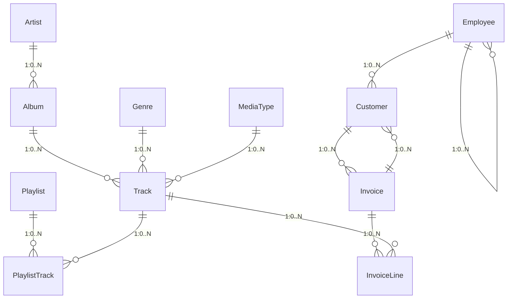

# 数据库分析报告

## 执行摘要

该数据库是一个音乐商店管理系统，包含完整的音乐管理、销售和客户关系数据。系统主要涉及艺术家、专辑、曲目、流派、媒体类型、客户、员工和发票等核心实体，构建了一个完整的音乐销售与管理生态系统。

## 实体关系图

## 表详情

### Artist（艺术家表）
| 字段名 | 数据类型 | 描述 |
|--------|----------|------|
| ArtistId | INTEGER | 主键，艺术家唯一标识符 |
| Name | NVARCHAR(120) | 艺术家名称 |

### Album（专辑表）
| 字段名 | 数据类型 | 描述 |
|--------|----------|------|
| AlbumId | INTEGER | 主键，专辑唯一标识符 |
| Title | NVARCHAR(160) | 专辑标题 |
| ArtistId | INTEGER | 外键，关联艺术家 |

### Track（曲目表）
| 字段名 | 数据类型 | 描述 |
|--------|----------|------|
| TrackId | INTEGER | 主键，曲目唯一标识符 |
| Name | NVARCHAR(200) | 曲目名称 |
| AlbumId | INTEGER | 外键，关联专辑 |
| MediaTypeId | INTEGER | 外键，关联媒体类型 |
| GenreId | INTEGER | 外键，关联流派 |
| Composer | NVARCHAR(220) | 作曲者 |
| Milliseconds | INTEGER | 毫秒数 |
| Bytes | INTEGER | 字节数 |
| UnitPrice | NUMERIC(10,2) | 单价 |

### Genre（流派表）
| 字段名 | 数据类型 | 描述 |
|--------|----------|------|
| GenreId | INTEGER | 主键，流派唯一标识符 |
| Name | NVARCHAR(120) | 流派名称 |

### MediaType（媒体类型表）
| 字段名 | 数据类型 | 描述 |
|--------|----------|------|
| MediaTypeId | INTEGER | 主键，媒体类型唯一标识符 |
| Name | NVARCHAR(120) | 媒体类型名称 |

### Customer（客户表）
| 字段名 | 数据类型 | 描述 |
|--------|----------|------|
| CustomerId | INTEGER | 主键，客户唯一标识符 |
| FirstName | NVARCHAR(40) | 客户名 |
| LastName | NVARCHAR(20) | 客户姓 |
| Company | NVARCHAR(80) | 公司名称 |
| Address | NVARCHAR(70) | 地址 |
| City | NVARCHAR(40) | 城市 |
| State | NVARCHAR(40) | 州/省 |
| Country | NVARCHAR(40) | 国家 |
| PostalCode | NVARCHAR(10) | 邮政编码 |
| Phone | NVARCHAR(24) | 电话 |
| Fax | NVARCHAR(24) | 传真 |
| Email | NVARCHAR(60) | 邮箱 |
| SupportRepId | INTEGER | 外键，关联支持代表（员工） |

### Employee（员工表）
| 字段名 | 数据类型 | 描述 |
|--------|----------|------|
| EmployeeId | INTEGER | 主键，员工唯一标识符 |
| LastName | NVARCHAR(20) | 员工姓 |
| FirstName | NVARCHAR(20) | 员工名 |
| Title | NVARCHAR(30) | 职位 |
| ReportsTo | INTEGER | 外键，报告给的员工 |
| BirthDate | DATETIME | 出生日期 |
| HireDate | DATETIME | 入职日期 |
| Address | NVARCHAR(70) | 地址 |
| City | NVARCHAR(40) | 城市 |
| State | NVARCHAR(40) | 州/省 |
| Country | NVARCHAR(40) | 国家 |
| PostalCode | NVARCHAR(10) | 邮政编码 |
| Phone | NVARCHAR(24) | 电话 |
| Fax | NVARCHAR(24) | 传真 |
| Email | NVARCHAR(60) | 邮箱 |

### Invoice（发票表）
| 字段名 | 数据类型 | 描述 |
|--------|----------|------|
| InvoiceId | INTEGER | 主键，发票唯一标识符 |
| CustomerId | INTEGER | 外键，关联客户 |
| InvoiceDate | DATETIME | 发票日期 |
| BillingAddress | NVARCHAR(70) | 账单地址 |
| BillingCity | NVARCHAR(40) | 账单城市 |
| BillingState | NVARCHAR(40) | 账单州/省 |
| BillingCountry | NVARCHAR(40) | 账单国家 |
| BillingPostalCode | NVARCHAR(10) | 账单邮政编码 |
| Total | NUMERIC(10,2) | 总金额 |

### InvoiceLine（发票行项目表）
| 字段名 | 数据类型 | 描述 |
|--------|----------|------|
| InvoiceLineId | INTEGER | 主键，发票行项目唯一标识符 |
| InvoiceId | INTEGER | 外键，关联发票 |
| TrackId | INTEGER | 外键，关联曲目 |
| UnitPrice | NUMERIC(10,2) | 单价 |
| Quantity | INTEGER | 数量 |

### Playlist（播放列表表）
| 字段名 | 数据类型 | 描述 |
|--------|----------|------|
| PlaylistId | INTEGER | 主键，播放列表唯一标识符 |
| Name | NVARCHAR(120) | 播放列表名称 |

### PlaylistTrack（播放列表曲目表）
| 字段名 | 数据类型 | 描述 |
|--------|----------|------|
| PlaylistId | INTEGER | 外键，关联播放列表 |
| TrackId | INTEGER | 外键，关联曲目 |

## 数据完整性分析

1. **主键约束**：所有表都定义了主键，确保记录唯一性。
2. **外键约束**：建立了完整的关系约束，如专辑与艺术家、曲目与流派等。
3. **级联操作**：所有外键都设置为"NO ACTION"，防止意外删除。
4. **数据类型**：合理使用了数据类型，如NUMERIC用于金额，DATETIME用于日期时间。

## 建议改进

1. **索引优化**：在经常查询的字段上创建索引，如Customer.Email、Track.GenreId等。
2. **数据验证**：添加检查约束确保数据完整性，如价格不能为负数。
3. **审计字段**：添加创建时间和修改时间字段以支持审计需求。
4. **数据归档**：对于历史发票数据，考虑使用分区或归档机制。